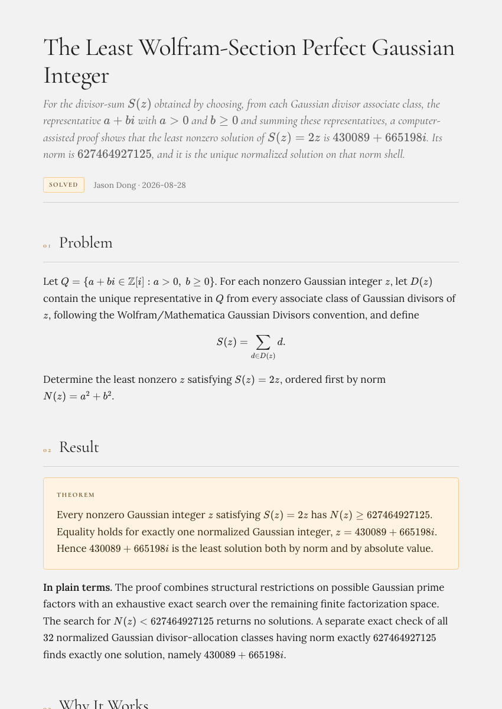
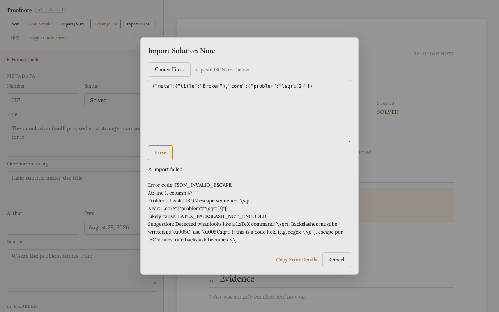

# Proofnote

### Structured math, without the JSON pain.

**Proofnote** is an AI-friendly format, validator, editor, and renderer for
mathematical and computer-science results.

Write structured Solution Note JSON, catch broken LaTeX and malformed input
with precise diagnostics, and export beautiful standalone HTML — entirely offline.

**AI-friendly · LaTeX-safe · Structured · Diagnosable · Portable**

[Try Proofnote](https://donghaoxuan13818851792-code.github.io/proofnote/?sample) · [AI authoring guide](docs/ai-authoring.md) · [Format schema](schema/solution-note-1.0.schema.json) · [Examples](examples/)

<p align="center">
  
</p>

## It tells you where, why, and how to fix it

```
✗ Import failed

JSON_INVALID_ESCAPE
Line 6, Column 42

Found:
\sqrt

Likely cause:
LATEX_BACKSLASH_NOT_ENCODED

Suggested:
\u005Csqrt
```

Proofnote doesn't just tell you your JSON is broken. It tells you **where, why,
and how to fix it**.

<p align="center">
  
</p>

## Quick start

Open `index.html` in any modern browser (Safari, Chrome, Firefox). No build
step, no server, no network needed — everything runs locally.

Run the test suite:

```bash
npm install
npm test
```

## What it does

- **Dual-language UI** — Chinese and English, switchable in the toolbar.
- **JSON import/export** — paste an AI-produced note or a hand-edited file; get
  tiered diagnostics (JSON syntax → schema → content → render), never a silent
  failure.
- **LaTeX-safe by construction** — every math expression is real KaTeX; the AI
  authoring profile requires `\u005C` JSON-encoded backslashes, and the
  validator catches raw backslashes with actionable suggestions.
- **Standalone HTML export** — one self-contained file with embedded KaTeX and
  body fonts, styled for reading, printing, and sharing.
- **Safe by default** — HTML escaping (including quotes), `safeHref` filtering
  of markdown links, KaTeX `trust: false`, prototype-pollution guards, and a
  strict block whitelist for imported content.

## Format

Proofnote speaks one canonical format — **Solution Note Format 1.0** — defined
in [`schema/solution-note-1.0.schema.json`](schema/solution-note-1.0.schema.json).

A separate, simplified **AI Authoring Profile** describes the compact JSON an
LLM should emit; Proofnote normalizes it into the canonical form before
rendering. See [`docs/ai-authoring.md`](docs/ai-authoring.md).

## Diagnostics

JSON errors are reported with structure, not jargon. See
[`docs/diagnostics.md`](docs/diagnostics.md) for the full error taxonomy, and
[`docs/escaping.md`](docs/escaping.md) for the security model.

## Repository layout

```
proofnote/
├── index.html              ← app entry point; runs fully offline from the clone
├── src/doc-page.js         ← preview page shell
├── vendor/                 ← vendored dependencies (KaTeX, fonts, design system)
├── schema/                 ← Solution Note Format 1.0 JSON Schema
├── docs/                   ← format, AI authoring, escaping, diagnostics
├── examples/               ← sample notes (incl. the Gaussian integer showcase)
└── tests/                  ← regression + i18n suites (npm test)
```

> Note: `index.html` is the app's entry point and needs its `vendor/` and `src/`
> resources — it is *not* a single self-contained file. The **exported HTML**
> (via the editor) is the truly self-contained, offline artifact.

## License

MIT — see [LICENSE](LICENSE).
