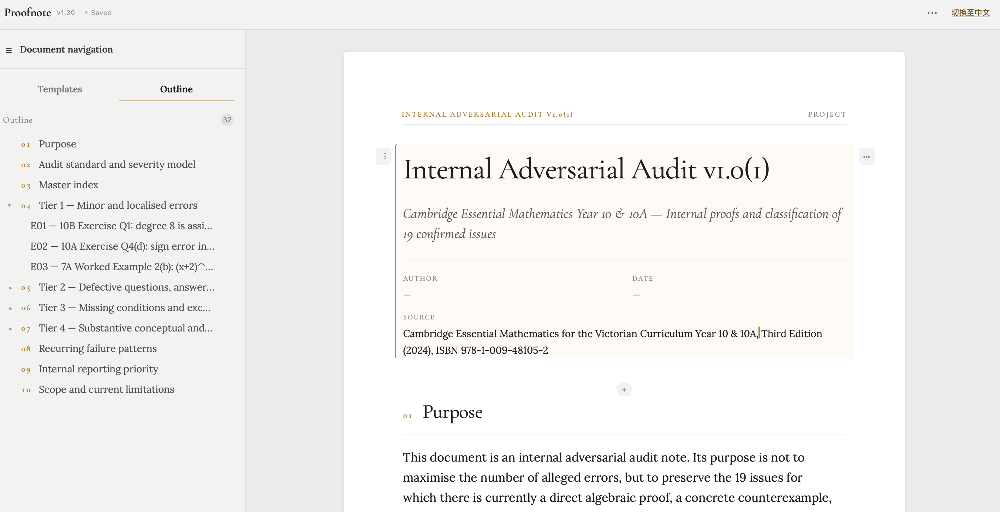

# Proofnote

> Turn source material, research notes, and AI output into structured documents
> that are calm to read, safe to keep, and simple to share.

[Open Proofnote](https://donghaoxuan13818851792-code.github.io/ProofNote/?sample) · [Document format](docs/document-format.md) · [AI authoring guide](docs/ai-document-authoring.md) · [Diagnostics](docs/diagnostics.md) · [Examples](examples/)

<p align="center">
  
</p>

**Proofnote** is a local-first, AI-friendly document editor for research notes,
technical reports, mathematical writing, and structured investigations. It turns
ordered content blocks into an editorial reading surface instead of a generic
form or a Markdown preview.

Write directly on the page, start from a considered template, or import strict
JSON generated by an AI. Proofnote preserves the document as portable source
data, catches problems before they erase meaning, and exports a standalone HTML
document when it is ready to leave your device.

**Local-first · Paper-first · LaTeX-safe · Structured · Portable**

## A document editor for finished thinking

### Read first; edit exactly where needed

The canvas reads like the exported document: prose, inline mathematics,
semantic sections, and quotations render in their final typographic voice. Click
the part you want to change and Proofnote reveals the native editor in place.
There is no separate preview mode to keep in sync.

### Give structure a visual language

Use 16 document block types—headings, paragraphs, equations, code, tables,
images, quotes, lists, callouts, semantic blocks, and more—without hand-tuning
fonts, margins, or colours. Editorial sections, theorem-like results, proofs,
verification, and introductions receive distinct treatment when that meaning is
actually present.

### Keep long work navigable

The Outline is a structural view of the document, not a second copy of it. Add
peer sections and subsections, collapse a branch, move or duplicate a complete
subtree, and remove an entire section only with an explicit confirmation.

### Work with AI without trusting it blindly

Copy a format-aware AI brief, then import one strict `proofnote-document` JSON
object. Import diagnostics point to the exact line, column, block, and field at
fault; they explain common JSON and LaTeX escaping mistakes and distinguish a
blocking problem from a recoverable warning.

### Keep the source; share the result

Every document stays in an on-device library backed by IndexedDB where
available. Export a `.proofnote.json` backup to continue editing elsewhere, or
export self-contained HTML with embedded typography, KaTeX output, code
highlighting, and local images for reading, printing, or sharing.

<p align="center">
  
</p>

## What is included

| Area | What Proofnote provides |
| --- | --- |
| **Document building** | Title, subtitle, heading, paragraph, equation, code, table, image, quote, divider, page break, callout, semantic, list, key–value, and statistics blocks. |
| **Research structure** | Built-in Blank Document, Proof Note, Research Note, Lab Report, and Essay / Report templates; reusable custom templates; Project documents with editable running headers and footer. |
| **Mathematics and code** | Inline and display KaTeX; syntax-labelled code blocks; restrained Prism rendering in standalone HTML exports. |
| **AI import** | A schema-backed JSON format, actionable syntax and schema diagnostics, duplicate-key checks, table-shape protection, and LaTeX escape guidance. |
| **Local documents** | Separate recent-document library, rename, duplicate, delete, import-as-new-document, revision protection, and local template storage. |
| **Portable output** | Self-contained HTML, a re-importable Proofnote JSON backup, and explicit Solution Note 1.0 compatibility export. |
| **Language and privacy** | Chinese and English UI; no account or backend required; remote images require an explicit per-image approval. |

## Typical workflow

1. Start a Project or choose a built-in template.
2. Write on the page, or use **Copy AI format** to prepare a structured JSON
   import prompt.
3. Import as a new document. Proofnote tells you precisely what to repair if
   the JSON, schema, table shape, or LaTeX serialization is unsafe.
4. Use the Outline to shape the whole argument rather than rearranging isolated
   paragraphs.
5. Export **HTML** for a polished deliverable and **Proofnote source** for a
   durable, editable backup.

## Data safety by design

Proofnote is deliberately conservative at document boundaries:

- Imported content is validated before it reaches the editor.
- Rendering, table, image, and text budgets prevent a valid-looking file from
  freezing the browser or silently truncating content.
- Export checks the same portable limits used by import, so a downloaded
  Proofnote backup can be imported again by the same version.
- HTML and Markdown are escaped; unsafe links are rejected; KaTeX runs with
  `trust: false`.
- Local images are stored in the document and embedded in standalone HTML.
  Remote images stay unloaded until the reader approves the exact URL.

Read the full [format and storage contract](docs/document-format.md), the
[JSON/LaTeX escaping guide](docs/escaping.md), and the
[diagnostics reference](docs/diagnostics.md).

## Get started

Proofnote has no build step and no required server. Clone the repository, then
open `index.html` in Safari, Chrome, or Firefox.

```bash
git clone https://github.com/donghaoxuan13818851792-code/ProofNote.git
cd ProofNote
open index.html
```

To serve the same files locally instead:

```bash
python3 -m http.server 4173 --bind 127.0.0.1
# Open http://127.0.0.1:4173/
```

Run the complete regression, model, persistence, editor, and boundary suite:

```bash
npm install
npm test
```

## Formats and compatibility

| Format | Use it for |
| --- | --- |
| [`proofnote-document` 1.0](schema/proofnote-document-1.0.schema.json) | The native portable format for AI integrations, backups, templates, and further editing. |
| Standalone HTML | A self-contained, presentation-ready document that retains Proofnote typography, KaTeX, code highlighting, and local images. |
| [`solution-note` 1.0](schema/solution-note-1.0.schema.json) | Importing older Solution Notes and exporting a compatibility view when a collaborator still needs that format. |

## Documentation

- [Document Format 1.0](docs/document-format.md) — block shapes, templates,
  local library behaviour, portability, and image rules.
- [AI document authoring](docs/ai-document-authoring.md) — a concise contract
  for producing safe, useful Proofnote JSON.
- [Solution Note authoring](docs/ai-authoring.md) — the legacy-compatible AI
  profile.
- [Diagnostics](docs/diagnostics.md) — syntax, schema, and rendering feedback.
- [Escaping](docs/escaping.md) — why LaTeX backslashes need careful JSON
  serialization.

## Repository map

```text
proofnote/
├── index.html                    app entry point
├── src/document-model.js         portable Document Format and migration model
├── src/document-store.js         IndexedDB-first document and template library
├── src/document-renderer.js      shared Markdown, KaTeX, and export rendering
├── src/document-editor.*         paper-first editor workspace and styles
├── src/doc-page.js               print-aware document page shell
├── schema/                       Proofnote and Solution Note schemas
├── docs/                         format, diagnostics, AI guides, and assets
├── vendor/                       vendored KaTeX, Prism, fonts, and UI assets
├── examples/                     example documents
└── tests/                        regression, model, store, editor, and boundary tests
```

> `index.html` needs the adjacent `src/` and `vendor/` files. Exported HTML,
> on the other hand, is the fully self-contained artifact.

## License

[MIT](LICENSE)
